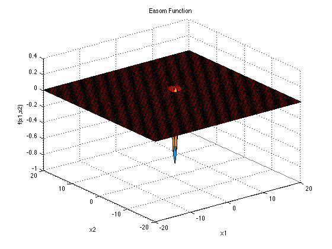

# PPSO
Parallel Particle Swarm Optimization implementations

3 different implementations:

- using OpenMP framework
- using message passing paradigm MPI
- using GPU power with CUDA

Benchmark functions used to evaluate the performance of the various implementations:


- Easom function

  ```math
  f(x) = -(x_2 + 47)sin(\sqrt{\bigg| x_2 + \frac{x_1}{2} + 47 \bigg|}) - x_1\sin(\sqrt{|x_1 - (x_2 + 47)|}) 
  ```
  

- Eggholder function
  
  ```math
  f(x) = -cos(x_1)cos(x_2)\exp{(-(x_1 - \pi)^2 - (x_2 - \pi)^2)}
  ```

  
